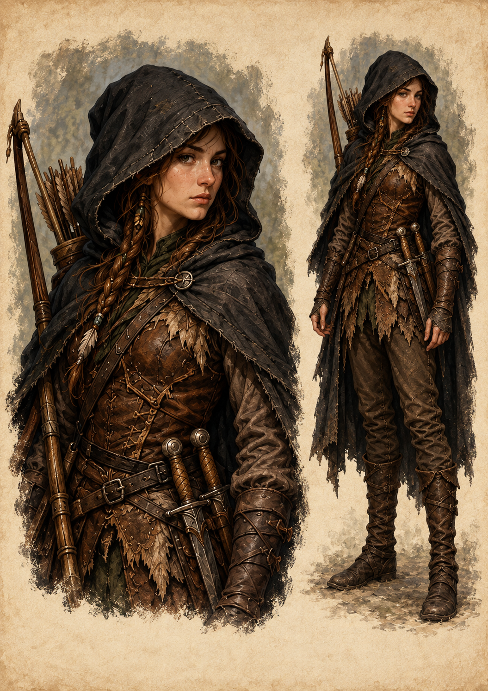

# Jânia — capuz habitual

Jânia usa habitualmente o capuz levantado. A referência mantém sua identidade e o conjunto visual da ficha original: cabelo castanho com tranças, capa escura, couro em tons terrosos, braçadeiras, cintos, arco, aljava e duas adagas. O capuz avança um pouco mais sobre a cabeça; o rosto continua reconhecível.

## Referência e limites

- Referência principal: retrato da ficha ilustrada original de Jaina Woodward.
- A imagem apresenta retrato e corpo inteiro da mesma personagem.
- Nesta vista, o tecido cobre as orelhas. Isso não altera sua anatomia élfica.
- Pernas e botas completam visualmente a figura; seus detalhes não aparecem no recorte original e permanecem uma proposta visual.
- Nenhuma mudança de atributos, equipamento, poderes ou história está proposta.
- A cor dos olhos não é fixada por esta referência.
- Cenas que exigem máscara ou rosto totalmente coberto mantêm essa condição até a revelação prevista na história. Capuz habitual e disfarce de cena são condições distintas.

A referência original permanece preservada. Esta variante foi aprovada em 7 de outubro de 2026.
