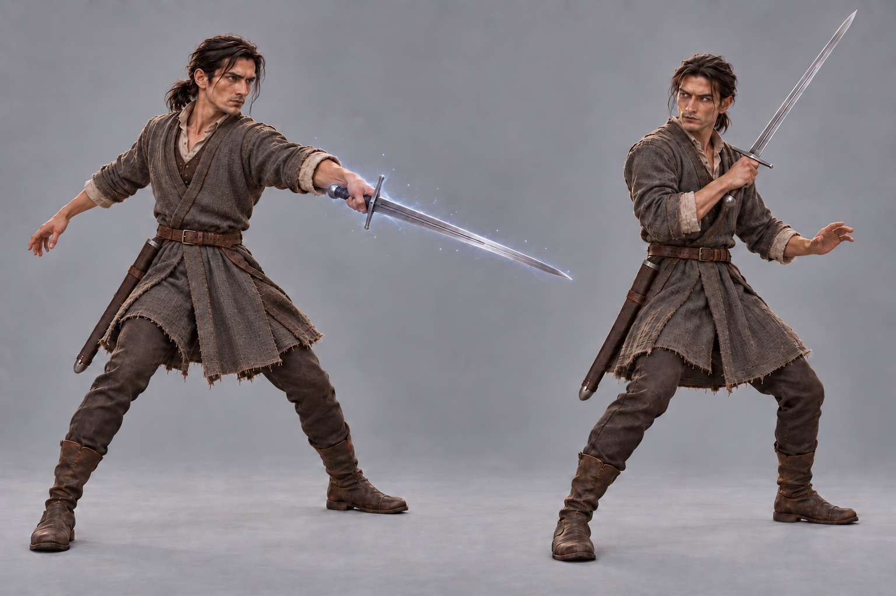

# Kaelen — Acervo visual

Ponto de consulta para ilustrações e HQs. O descritivo visual fica nesta pasta.

## Referências disponíveis

- [Descrição visual e referências](descricao.md)
- [Assinaturas gráficas de magias e golpes](assinaturas-graficas.md) — propostas de identidade visual, com fontes e limites de continuidade.
- [Identidade e trajetória do personagem](../README.md)

## Continuidade antes e depois do anel

- [Antes do anel: retrato v0006](kaelen-antes-do-anel-v0006.png) — cicatrizes marcadas, olhos fundos, traços irregulares, cabelo desalinhado e ombros curvados; corpo esguio preservado.
- [Depois do anel: retrato v0002](kaelen-retrato-v0002.png) — referência posterior preservada.
- [Descrição das duas aparências e limites de continuidade](descricao.md#aparências-antes-e-depois-do-anel)

## Piloto visual em revisão

Publicado a pedido do usuário em 4 de outubro de 2026 como piloto para revisão visual. Vistas e poses podem receber ajustes e não alteram a ficha do personagem.

- [Retrato de referência v0002](kaelen-retrato-v0002.png)
- [Folha de referência com múltiplas vistas v0002](kaelen-referencia-v0002.png)
- [Estudo com duas poses de ação v0003 — Vínculo com Arma](kaelen-acao-v0003.png)
- [Estudo de ação anterior v0002, sem o efeito](kaelen-acao-v0002.png) — mantido como histórico visual.
- [Token VTT circular, PNG transparente](kaelen-token-vtt-v0001.png)

## Efeito da espada na imagem de ação

Atualizado em 04/10/2026 a pedido do usuário. A v0003 preserva a identidade, o traje e as duas poses da v0002. Na pose à esquerda, uma aura prateada-azulada tênue marca o instante final da espada aparecendo diretamente na mão pelo Vínculo com Arma. Na pose à direita, o efeito já cessou e a lâmina permanece metálica. Não há portal, armazenamento extradimensional, sabre luminoso ou alteração de ficha.

Manter a identidade do retrato entre as vistas e poses. A direção visual do piloto e as fontes de roupa, armadura e espada estão no [descritivo visual](descricao.md). As sugestões e os detalhes ainda não confirmados continuam identificados ali.

